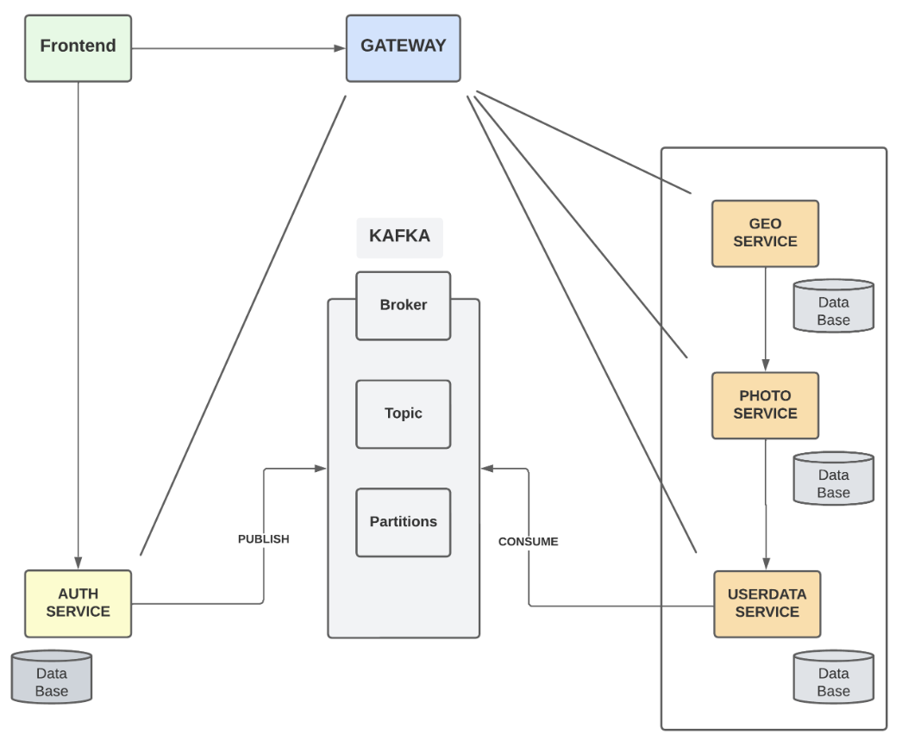
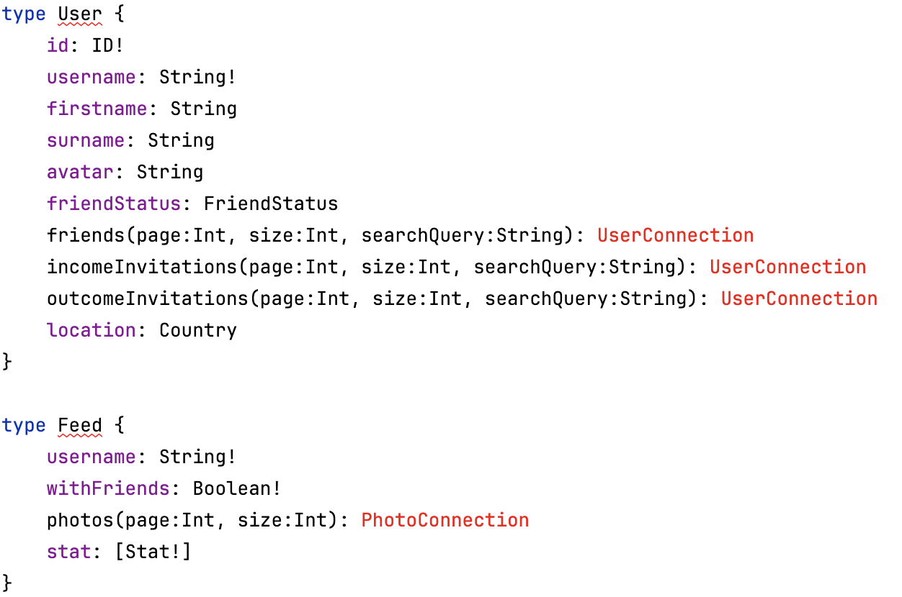
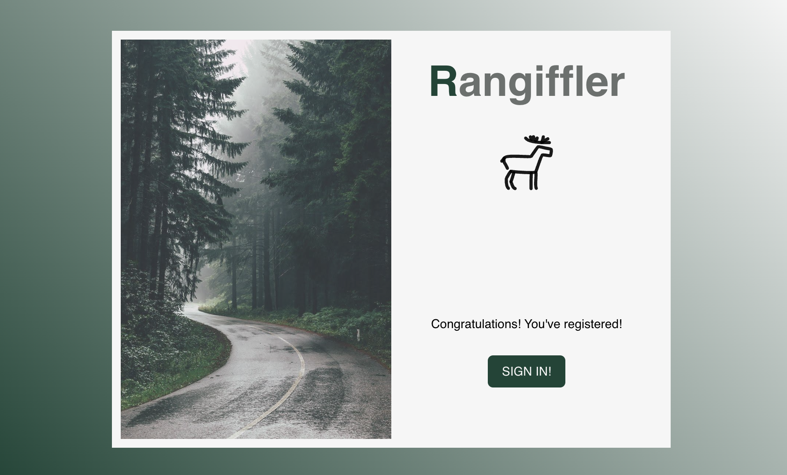

# Rangiffler

  Приветствую тебя, мой дорогой студент!
Если ты это читаешь - то ты собираешься сделать первый шаг в написании диплома QA.GURU Advanced.

  Это один из двух вариантов дипломной работы - второй расположен [тут, называется Rococo](https://github.com/qa-guru/rococo)
Проекты отличаются как по своей механике, так и технологиям (Rococo использует классический REST на frontend,
тогда как Rangiffler использует GraphQL). Следует сказать, что Rangiffler может отказаться немного сложнее именно из-за GraphQL, но,
в качестве компенсации за сложность, даст тебе больше интересного опыта.
Выбор за тобой!

  Далее я опишу основные направления работы, но помни, что этот диплом - не шаблонная работа, а место
для творчества - прояви себя!

  Кстати, Rangiffler - произошло от названия северных оленей - Rangifer. Мы выбрали именно такое
название для этого проекта - потому, что он про путешествия, а северный олень - рекордсмен по
преодолеваемым расстояниям на суше. Путешествуй, be like Rangiffler! (это девиз этого проекта)

# Что будет являться готовым дипломом?

  Тут все просто, диплом глобально требует от тебя реализовать три вещи:

- Реализовать бэкенд на микросервисах (Spring boot, но если вдруг есть желание использовать что-то другое - мы не против)
- Реализовать полноценное покрытие тестами микросервисов и frontend (если будут какие-то
  unit-тесты - это большой плюс!)
- Красиво оформить репозиторий на гихабе, что бы любой, кто зайдет на твою страничку, смог понять,
  как все запустить, как прогнать тесты. Удели внимание этому пункту. Если я не смогу все запустить по твоему README - диплом останется без проверки

# Текущая структура проекта

```
rfr/
├── rfr-auth/              # OAuth 2.0 Authorization Server (готов)
├── rfr-api/               # GraphQL API Backend (базовая реализация)
│   ├── Mock контроллеры для фотографий
│   ├── Реальные контроллеры для пользователей и стран
│   └── Flyway миграции БД
├── rfr-gql-client/        # React + TypeScript Frontend (готов)
└── rfr-e2e/               # E2E тесты: JUnit 6 + Playwright + Allure 3 (заготовка)
```

**Порты:**
- rfr-auth: 9001
- rfr-api: 8081
- rfr-gql-client: 3001

**Технологии:**
- Сборка: Java 25, Gradle 9.7.1
- Backend: Spring Boot 4.1.1, Spring for GraphQL, Spring Security, JPA, Flyway
- Frontend: React 19, TypeScript 6, Vite 8, Apollo Client 4, Material UI 9, React Router 8
- Auth: Spring Authorization Server
- БД: MySQL 8.4
- E2E: JUnit 6, Playwright Java 1.63, Allure 3

# С чего начать?

Мы подготовили для тебя полностью рабочий frontend, минимально работающий сервис auth, а также базовую реализацию rfr-api с mock контроллерами.
Так как данный проект использует GraphQL, а frontend уже написан под конкретный API, то в проекте есть файл
`rfr-api/src/main/resources/graphql/query.graphqls` - он используется бэкендом rfr-api, куда прилетают все запросы с фронта.

Т.к. механика проекта сложнее, чем в Niffler и в Rococo, а именно, подразумевает хранение фоток, лайков, статистики, дружбы с другими юзерами и т.д.,
я добавил в проект схему базы данных - `V1__schema_init.sql`. 
Обрати внимание, что он написан так, как будто весь бэкенд Rangiffler - один монолитный сервис с монолитной же базой данных. В то время как диплом подразумевает микросервисную архитектуру,
и каждый из сервисов будет использовать 1-2 таблицы из этого скрипта. Но, на первом этапе, вы можете создать "монолитную" базу как есть этим скриптом,
и уже потом думать, как ее разбивать на сервисы.

В проекте уже есть минимальная реализация rfr-api с mock контроллерами для фотографий. Это позволяет сразу увидеть механику проекта Rangiffler.
Mock контроллеры возвращают статические данные из JSON файлов (`resources/mock/`), что позволяет протестировать frontend без полной реализации бэкенда.
Важно понимать, что несмотря на наличие моков mutation запросов (например, удаление фото), никакого реального удаления не произойдет, и при обновлении страницы 
будут возвращены те же данные из JSON файлов.

У тебя также есть проект Niffler, который будет выступать образцом для подражания в разработке микросервисов.
Тестовое покрытие niffler, которого мы с тобой добились на настоящий момент, однако, является достаточно слабым - учтите это при написании тестов на Rangiffler - это,
все-таки, диплом для SDET / Senior QA Automation и падать в грязь лицом с десятком тестов на весь сервис
точно не стоит. Итак, приступим!

#### 1. Запусти зависимости (БД):

```bash
bash localenv.sh
```

Скрипт запустит MySQL в Docker контейнере.

#### 2. Запусти rfr-auth:

```bash
cd rfr-auth
../gradlew bootRun
```

Или запусти класс с методом main руками. Auth будет доступен на порту 9001: http://localhost:9001

#### 3. Запусти rfr-api:

```bash
cd rfr-api
../gradlew bootRun
```

rfr-api стартанет на порту 8081: http://localhost:8081/graphql

GraphiQL интерфейс доступен по адресу: http://localhost:8081/graphiql

#### 4. Обнови зависимости и запускай фронт:

```bash
cd rfr-gql-client
npm i
npm run dev
```

Фронт стартанет в твоем браузере на порту 3001: http://localhost:3001/

#### 5. Проверь работоспособность

Кнопка "Login" работает через сервис auth. После успешной авторизации ты попадешь на главную страницу Rangiffler.

Mock контроллеры в rfr-api будут возвращать статические данные из JSON файлов для ленты фотографий.
Реальная работа с пользователями и странами уже реализована через базу данных.


# Что дальше?

#### 1. В первую очередь, необходимо подумать над сервисами - какие тебе понадобятся.

  Например, можно предложить вот такую структуру сервисов:



  ВАЖНО! Картинка - не догма, а лишь один из вариантов для примера. 
Например, для хранения статистики можно отдельный сервис сделать.
Взаимодействие между gateway и всеми остальными сервисами можно сделать с помощью
REST, gRPC или SOAP. Я бы посоветовал отдать предпочтение gRPC.

#### 2. Изучи текущую реализацию rfr-api

В проекте уже есть базовая монолитная реализация rfr-api. Что уже реализовано:

**Готово:**
- Security (`RangifflerApiConfiguration`): OAuth 2.0 Resource Server, CORS, `@PreAuthorize` на контроллерах
- GraphQL схема `rfr-api/src/main/resources/graphql/query.graphqls`
- Java-модели GraphQL типов (`User`, `Country`, `Feed`, `Photo`, `Stat`, `Likes` и inputs) — их генерирует плагин
  DGS Codegen (задача `generateJava` в `rfr-api/build.gradle`) в пакет `io.student.rangiffler.model.types`, писать их руками не нужно
- Mock контроллеры для фотографий (FeedMockQueryController, PhotoMockMutationController): лента отдается с пагинацией
  и поддерживает фильтр по стране `photos(country: "fr")`
- Реальные контроллеры для пользователей, дружбы и стран (UserQueryController, UserMutationController, CountryQueryController)
- Сервисный слой (UserService, CountryService)
- JPA entities, repositories и projection `UserWithStatus`
- Единый контракт ошибок GraphQL (`GraphQlExceptionResolver`)
- Flyway миграции для БД
- Mock данные в JSON файлах (`resources/mock/`)

**Что нужно доработать:**
- Заменить mock контроллеры фотографий на реальную реализацию с БД
- Добавить entity и repository для фотографий
- Реализовать сервис для работы с фотографиями
- Реализовать функционал лайков
- Реализовать статистику по странам

Все важные подсказки ниже, в разделе "Особенности реализации backend"

#### 3. Как только у вас появилось уже 2 сервиса, есть смысл подумать о докеризации

  Чем раньше у ваc получится запустить в докере фронт и все бэкенды, тем проще будет дальше.
На самом деле, докеризация не является строго обязательным требованием, но если вы хотите в будущем
задеплоить свой сервис на прод, прикрутить CI/CD, без этого никак не обойдется.

  Я советую использовать плагин jib - как в niffler, для бэкендов, и самописный dockerfile для фронта.
Фронтенд использует React, докеризация там работает ровно так же, как и в Niffler.

#### 4. Выбрать протоколо взаимодействия между сервисами

  В поставляемом фронтенде используется [GraphQL](https://graphql.org/). А вот взаимодействие между микросервисами можно
делать как угодно! REST, gRPC, SOAP. Делай проект я, однозначно взял бы gRPC - не писать руками кучу
model-классов, получить перформанс и простое написание тестов. Стоит сказать, что здесь не
понадобятся streaming rpc, и все ограничится простыми унарными запросами. Однако если вы хотите
использовать REST или SOAP - мы не будем возражать.

#### 5. Реализовать микросервисный бэкенд

  Это место где, внезапно, СОВА НАРИСОВАНА!
На самом деле, концептуально и технически каждый сервис будет похож на что-то из niffler, поэтому
главное внимательность и аккуратность. Любые отхождения от niffler возможны - ты можешь захотеть
использовать, например, NoSQL базы или по другому организовать конфигурацию / структуру проекта -
никаких ограничений, лишь бы сервис выполнял свое прямое назначение

##### Особенности реализации backend

###### Connection-типы данных для GraphQL, пагинация

  В отличие от Niffler, в поставляемом файле `query.graphqls` есть несколько используемых типов `type` - которые не описаны в этом файле!
Это типы `UserConnection` и `PhotoConnection`. Даже IDEA отобразит их красным: 



  **Однако, это не ошибка.** Дело в том, что типы с именем `{Typename}Connection` генерируются автоматически и представляют собой ни что иное,
как реализацию пагинации для GraphQL. То есть все типы `{Typename}Connection` можно упрошенно считать "Коробочкой, в которой есть список {Typename}
и механизмы навигации к следующей и предыдущей страницам". Поэтому, эти типы описывать в файле `query.graphqls` руками не нужно, обращать внимание
на "красноту" в IDEA тоже не нужно. Почитать о том, что они действительно генерируются автоматически, [можно тут](https://docs.spring.io/spring-graphql/reference/request-execution.html#execution.pagination)

  Как ты понял из вышесказанного пункта, Rangiffler действительно использует пагинацию для фоток и пользователей. Это значит, что вам надо концептуально понять, как решается две задачи:
    - Что вернуть из контроллеров в качестве ответа с типом `{Typename}Connection` - с учетом что мы его не описываем руками и классы для него не создаем
    - Как сделать запрос в БД с пагинацией, что бы было, что возвращать. Ответы будут ниже

###### Pageable контроллеры (дата-фетчеры) для GraphQL

  Пусть у нас есть тип User:
```graphql
type User {
    id: ID!
    username: String!
}
```
  и есть query с пагинацией на запрос всех юзеров:
```graphql
type Query {
  users(page:Int = 0, size:Int = 10, searchQuery:String): UserConnection
}
```
  Java-класс нужен **только для типа User**. В проекте его генерирует DGS Codegen (`io.student.rangiffler.model.types.User`),
для `UserConnection` класс не создается. С точки зрения Spring-graphql типы `{Typename}Connection` не что иное, как `Slice<Typename>`
(или его наследник `Page<Typename>`) из пакета `org.springframework.data.domain`. Для codegen это соответствие прописано в `rfr-api/build.gradle`:
```groovy
generateJava {
    typeMapping = [
        'UserConnection' : 'org.springframework.data.domain.Page<io.student.rangiffler.model.types.User>',
        'PhotoConnection': 'org.springframework.data.domain.Page<io.student.rangiffler.model.types.Photo>',
        'Date'           : 'java.time.LocalDate'
    ]
}
```
  Таким образом в нашем примере контроллер для query `users` вернет `Page<User>`:
```java
  @QueryMapping
  public Page<User> users(@AuthenticationPrincipal Jwt principal,
                          @Argument("page") @Nullable Integer page,
                          @Argument("size") @Nullable Integer size,
                          @Argument("searchQuery") @Nullable String searchQuery) {
    return userService.allUsers(
        principal.getClaim("sub"),
        pageRequest(page, size),
        searchQuery
    );
  }

  private static PageRequest pageRequest(@Nullable Integer page, @Nullable Integer size) {
    return PageRequest.of(
        Objects.requireNonNullElse(page, DEFAULT_PAGE),
        Objects.requireNonNullElse(size, DEFAULT_SIZE)
    );
  }
```
  Здесь первый аргумент - это просто сессия (как и в Niffler), `page, size` - аргументы пагинации, они прилетят с фронта.
Третий аргумент `String searchQuery` - необязательный аргумент, который фронт отправляет при использовании поиска в таблицах.
Обратите внимание на несколько деталей:
- `page` и `size` объявлены как `@Nullable Integer`, а не `int`: у аргументов в схеме есть значения по умолчанию, но клиент может явно
  передать `null` - тогда примитивный `int` уронит запрос.
- Имена аргументов указаны явно - `@Argument("page")`. Если имя не указано, Spring-graphql берет его из байткода, а для этого класс должен быть
  скомпилирован с флагом `-parameters`. Gradle-сборка Spring Boot его включает, а, например, сборка из VS Code (вывод в `bin/main`) - нет,
  и приложение падает на старте с `Name for argument of type [...] not specified`.
- Конструкция `PageRequest.of(page, size)` создает объект `Pageable` - и именно используя его мы можем получить из репозитория `Page`/`Slice`.

  `Page`/`Slice` - это ровно то, что ожидает получить фронт, вам лишь придется преобразовать `Page<UserEntity>` (или projection)
в `Page<User>`, для этого надо воспользоваться методом `map()`, имеющимся в классе `Page`.

  Почитать про пагинацию в JPA Repository, дополнительно, тут: https://www.baeldung.com/spring-data-jpa-pagination-sorting

###### Pageable в JpaRepository

  Дело в том, что единственный способ получить функционал пагинации - это доставать данные из БД **одним запросом**.

  Это значит, что если нам нужны допустим фотографии юзера с пагинацией, мы не можем сделать так:
```java
UserEntity user = findById(id);
return user.getPhotos();
```
  В этом коде _просто нет возможности использовать пагинацию._ Но что если нам нужно запросить фотографии юзера с пагинацией?

```java
  Page<PhotoEntity> findByUser(@Nonnull UserEntity user,
                               @Nonnull Pageable pageable);

```
  Вот так уже сработает - тут всего один запрос, и поэтому он работает с `Pageable`.

###### Дружба: одна строка на пару пользователей

  Дружба хранится в таблице `friendship` (см. `V1__schema_init.sql`) **одной строкой на пару пользователей**: `requester` - кто отправил заявку,
`addressee` - кому, и статус - enum `FriendshipStatus.PENDING`/`FriendshipStatus.ACCEPTED`. При принятии заявки строка не дублируется,
у нее меняется только статус. Отклонение заявки и удаление из друзей удаляют строку.

  Чтобы два пользователя не могли одновременно отправить друг другу встречные заявки, уникальность неупорядоченной пары
гарантирует сама БД - через генерируемые колонки:
```sql
user_low_id  binary(16) as (least(requester_id, addressee_id)) stored,
user_high_id binary(16) as (greatest(requester_id, addressee_id)) stored,
constraint uq_friendship_pair unique (user_low_id, user_high_id),
constraint ck_friendship_distinct check (requester_id <> addressee_id)
```

  В JPA дружба - самостоятельный агрегат `FriendshipEntity` со своим `FriendshipRepository`, а не коллекции внутри `UserEntity`:
- связи `requester`/`addressee` - `@ManyToOne(fetch = LAZY)` без каскадов;
- `@Version` - optimistic lock на случай, если один пользователь принимает заявку, а другой в этот момент ее отменяет;
- правила переходов живут в самой сущности: `FriendshipEntity.request(...)`, `accept(actor)`, `assertCanDecline(actor)` - принять или
  отклонить заявку может только ее получатель;
- найти связь двух пользователей в любом направлении можно одним запросом:
```java
public interface FriendshipRepository extends JpaRepository<FriendshipEntity, UUID> {

  @Query("select f from FriendshipEntity f " +
      "where (f.requester.id = :first and f.addressee.id = :second) " +
      "   or (f.requester.id = :second and f.addressee.id = :first)")
  Optional<FriendshipEntity> findPair(@Param("first") UUID first, @Param("second") UUID second);
}
```
  Конфликты параллельных изменений сервис превращает в понятную бизнес-ошибку, а не в `INTERNAL_ERROR`: новая заявка сохраняется через
`saveAndFlush` (ловим `DataIntegrityViolationException` от уникального индекса), а после принятия/удаления вызывается явный `flush()`
(ловим `OptimisticLockingFailureException`). Без явного flush SQL выполнится только на коммите транзакции - уже за пределами
`try/catch` в методе сервиса.

###### Списки пользователей со статусом дружбы одним запросом

  Все списки людей (All People, Friends, Income/Outcome invitations) достаются из БД одним запросом с пагинацией и сразу со статусом дружбы
относительно текущего пользователя. Для этого используется projection - record `UserWithStatus`, который заполняется прямо в JPQL
через `select new`:
```java
public record UserWithStatus(
    UUID id,
    String username,
    String firstname,
    String lastName,
    byte[] avatar,
    String countryCode,
    String countryName,
    byte[] countryFlag,
    FriendshipStatus friendshipStatus,
    Boolean isRequester
) {
}
```
```java
public interface UserRepository extends JpaRepository<UserEntity, UUID> {

  String SELECT_USER_WITH_STATUS =
      "select new io.student.rangiffler.data.projection.UserWithStatus(" +
          "u.id, u.username, u.firstname, u.lastName, u.avatar, c.code, c.name, c.flag, " +
          "f.status, " +
          "case when f.requester.id = :me then true when f.addressee.id = :me then false else null end) " +
          "from UserEntity u join u.country c ";
  String PAIR_WITH_ME =
      "FriendshipEntity f on (f.requester.id = :me and f.addressee = u) " +
          "or (f.addressee.id = :me and f.requester = u) ";
  String SEARCH =
      "and (lower(u.username) like lower(concat('%', :searchQuery, '%')) " +
          "or lower(u.firstname) like lower(concat('%', :searchQuery, '%')) " +
          "or lower(u.lastName) like lower(concat('%', :searchQuery, '%'))) ";
  String ORDER = "order by u.username asc";

  String ALL_USERS = SELECT_USER_WITH_STATUS + "left join " + PAIR_WITH_ME + "where u.id <> :me ";
  String FRIENDS = SELECT_USER_WITH_STATUS + "join " + PAIR_WITH_ME +
      "where f.status = io.student.rangiffler.data.entity.FriendshipStatus.ACCEPTED ";
  String INCOME_INVITATIONS = SELECT_USER_WITH_STATUS +
      "join FriendshipEntity f on f.requester = u and f.addressee.id = :me " +
      "where f.status = io.student.rangiffler.data.entity.FriendshipStatus.PENDING ";
  String OUTCOME_INVITATIONS = SELECT_USER_WITH_STATUS +
      "join FriendshipEntity f on f.addressee = u and f.requester.id = :me " +
      "where f.status = io.student.rangiffler.data.entity.FriendshipStatus.PENDING ";

  Optional<UserEntity> findByUsername(String username);

  @Query(ALL_USERS + ORDER)
  Page<UserWithStatus> findAllUsersWithFriendshipStatus(@Param("me") UUID me,
                                                        Pageable pageable);

  @Query(ALL_USERS + SEARCH + ORDER)
  Page<UserWithStatus> findAllUsersWithFriendshipStatus(@Param("me") UUID me,
                                                        @Param("searchQuery") String searchQuery,
                                                        Pageable pageable);

  @Query(FRIENDS + ORDER)
  Page<UserWithStatus> findFriends(@Param("me") UUID me,
                                   Pageable pageable);

  @Query(FRIENDS + SEARCH + ORDER)
  Page<UserWithStatus> findFriends(@Param("me") UUID me,
                                   @Param("searchQuery") String searchQuery,
                                   Pageable pageable);

  // findOutcomeInvitations / findIncomeInvitations - аналогично, по OUTCOME_INVITATIONS / INCOME_INVITATIONS
}
```
  Что здесь важно:
- `:me` - UUID текущего пользователя. Сервис один раз находит его по `username` из JWT, дальше запросы сравнивают id, а не строки.
- Связь с текущим пользователем ищется одним `join` по паре в любом направлении, а `isRequester` говорит, кто отправил заявку.
  Из пары `friendshipStatus` + `isRequester` сервис вычисляет `FriendStatus` для фронта: `ACCEPTED` → `FRIEND`,
  `PENDING` + `isRequester = true` → `INVITATION_SENT`, `PENDING` + `false` → `INVITATION_RECEIVED`, нет связи → `NOT_FRIEND`.
- Страна пользователя приходит в той же строке (`join u.country c`) - без отдельного запроса на каждого пользователя (N+1).
- Каждый запрос есть в двух вариантах - с поиском и без: `searchQuery` в JPQL обязателен, поэтому логика, какой из методов вызвать,
  живет в сервисе, в зависимости от того, пришел ли с фронта `searchQuery`.

###### EntityProjection в JpaRepository  

  В GQL схеме есть поле `isOwner: Boolean!` для того, что бы фотографии могли размечаться на свои / не свои. В идеале, делать это на уровне SQL (JPQL)
запроса прямо в репозитории, для этого надо ввести промежуточный слой - интерфейс или класс (record), реализующий паттерн EntityProjection.
Record + `select new` вы уже видели в `UserRepository` выше, а вот вариант с интерфейсом:
```java

public interface PhotoRepository extends JpaRepository<PhotoEntity, UUID> {

  interface FeedPhotoView {
    UUID getId();

    byte[] getPhoto();

    CountryEntity getCountry();

    String getDescription();

    LocalDateTime getCreatedDate();

    boolean isOwner();
  }

  // только "свои" фото, если параметр user - текущий пользователь
  @Nonnull
  Page<PhotoEntity> findByUserOrderByCreatedDateDesc(@Nonnull UserEntity user,
                                                     @Nonnull Pageable pageable);

  //  "свои" и "чужие" фото, если в листе List<UserEntity> users есть текущий пользователь и его друзья. В результате будут объекты интерфеса FeedPhotoView с правильным признаком isOwner
  @Nonnull
  @Query("select p.id as id, p.photo as photo, p.country as country, p.description as description, p.createdDate as createdDate, " +
      "case when p.user.username = :username then true else false end as isOwner " +
      "from PhotoEntity p where p.user in :users order by p.createdDate desc")
  Page<FeedPhotoView> findFeedPhotos(@Param("users") @Nonnull List<UserEntity> users,
                                     @Param("username") @Nonnull String username,
                                     @Nonnull Pageable pageable);
}
  
  ```
  Для дат используйте `java.time` (`LocalDateTime`, `LocalDate`), а не `java.util.Date`.

###### Передача информации о пагинации по gRPC (для примера) между сервисами, возврат `Slice`/`Page` из сервисов

  Тут все просто. Вам с фронта приходят `page, size` + не забыть про третий опциональный парметр - `searchQuery`. 
Тогда, к примеру, gRPC сообщение в сервис с пользователями будет таким:
```protobuf
message UsersRequest {
  string searchQuery = 1;
  int32 page = 2;
  int32 size = 3;
}

message UsersResponse {
  repeated User users = 1;
  boolean hasNext = 2;
}
```
  Тогда мы сможем вернуть на фронт созданный руками Slice (если по gRPC передавать еще и общее количество элементов - то `PageImpl`)
```java
            List<User> users = response.getUsersList()
                    .stream()
                    .map(UserMapper::fromGrpcMessage) // grpc-сообщение -> сгенерированный GraphQL-тип User
                    .toList();
            return new SliceImpl<>(users, PageRequest.of(page, size), response.hasNext());
```

  Здесь объект `PageRequest.of(page, size)` - это изначальные параметры page, size, а `response.hasNext()` - получаем
в самом микросервисе из объекта Slice/Page, который вернет JpaRepository.
Если ваши сервисы отдают `Slice`, а не `Page`, поменяйте `typeMapping` для `UserConnection`/`PhotoConnection` в `rfr-api/build.gradle`
на `org.springframework.data.domain.Slice<...>` - Spring-graphql умеет строить Connection из обоих типов.

###### Security config

   Запросы `POST /graphql` пропускаются фильтрами без авторизации, а доступ проверяется на уровне контроллеров
через `@PreAuthorize` (`@EnableMethodSecurity`): query-контроллеры требуют authority `read`, mutation-контроллеры - `write`.

   API принимает только **access token**, выпущенный для него: `rfr-auth` кладет в access token `aud: rangiffler-api`
и claim `authorities` (права пользователя из `rangiffler-auth.authority`), а `rfr-api` проверяет audience
(`spring.security.oauth2.resourceserver.jwt.audiences`) и превращает claim `authorities` в `GrantedAuthority`
(`JwtAuthenticationConverter` в `RangifflerApiConfiguration`). `id_token` предназначен фронтенду (`aud` = client_id),
поэтому API его отвергает с 401. Фронтенд использует `id_token` только как `id_token_hint` при logout.

   Access token живет 10 минут. При logout фронтенд отзывает его через `POST /oauth2/revoke` (RFC 7009, публичный клиент
идентифицируется по `client_id`), а затем вызывает OIDC logout. Учтите: access token - самодостаточный JWT, `rfr-api`
проверяет его локально по подписи и не знает об отзыве, поэтому отозванный токен продолжает приниматься API до `exp`.
Отзыв делает недействительной авторизацию на стороне `rfr-auth`; мгновенный отказ API потребовал бы opaque-токенов
и introspection.

   Для локального тестирования вы можете открыть страницу
GraphiQL (`spring.graphql.graphiql.enabled: true` уже включен в `application.yml`):
```java
    @Bean
    public SecurityFilterChain securityFilterChain(HttpSecurity http) throws Exception {
        corsCustomizer.apply(http);
        http.csrf(AbstractHttpConfigurer::disable)
            .authorizeHttpRequests(customizer ->
                customizer
                    .requestMatchers(HttpMethod.POST, "/graphql").permitAll()
                    .requestMatchers(HttpMethod.GET, "/graphiql/**").permitAll()
                    .anyRequest().authenticated()
            )
            .oauth2ResourceServer(oauth2 -> oauth2.jwt(Customizer.withDefaults()));
        return http.build();
    }
```
   Сами запросы из GraphiQL все равно потребуют токен - добавьте заголовок `Authorization: Bearer <access_token>` в разделе Headers
(токен можно взять в `localStorage` фронта после логина).

###### GraphQL контроллеры и @SchemaMapping

   Сгенерированные DGS Codegen классы (или ваши record'ы) можно "наполнять" данными по частям с помощью `@SchemaMapping`.
Таким образом если клиент запрашивает:
```json
     query user {
     user {
       id
       username
       friends(page: 0, size: 10) {
         edges {
           node {
             id
             username
           }
         }
         pageInfo {
           hasPreviousPage
           hasNextPage
         }
       }
     }
   }
```
  То бэкенд соберет ему ответ вот так: 
```java
  @QueryMapping
  public User user(@AuthenticationPrincipal Jwt principal) {
    return userService.createNewUserIfNotPresent(principal.getClaim("sub")); // Здесь будет null в полe friends
  }

  @SchemaMapping(typeName = "User", field = "friends") // будет вызван автоматически, т.к. в запросе фронт попросил friends
  public Page<User> friends(User user,
                            @Argument("page") @Nullable Integer page,
                            @Argument("size") @Nullable Integer size,
                            @Argument("searchQuery") @Nullable String searchQuery) {
    // получит на вход User user и добавит внутрь него Page<User> с друзьями
    return userService.friends(
        user.getUsername(),
        pageRequest(page, size),
        searchQuery
    );
  }
```
  Таким образом, ни при каких обстоятельствах, вызывать явно в своем коде методы, аннотированные как `@SchemaMapping` - не нужно!

###### Ошибки GraphQL

  GraphQL отвечает HTTP 200 даже при ошибке - ошибка приходит в массиве `errors` ответа. Чтобы фронт мог показать пользователю
понятный текст, а внутренние детали не утекали наружу, исключения классифицирует `GraphQlExceptionResolver`:

| Исключение | `extensions.classification` |
|---|---|
| `ResourceNotFoundException` (нет пользователя, страны, фото) | `NOT_FOUND` |
| `FriendshipActionException` (недопустимое действие с дружбой) | `BAD_REQUEST` |
| `IllegalArgumentException` (невалидный UUID, неверные page/size) | `BAD_REQUEST` |
| все остальное | `INTERNAL_ERROR` без деталей |

  Фронт показывает текст ошибки в снэкбаре только для `BAD_REQUEST` и `NOT_FOUND` (`src/api/graphqlError.ts`). Придерживайтесь этого контракта
и в своих сервисах - это удобно и для e2e-тестов: негативные сценарии проверяются по `classification` и `message`.

###### Spring Boot 4

- Spring Boot 4.1 использует Jackson 3: пакеты `tools.jackson.databind.*` вместо `com.fasterxml.jackson.databind.*`.
- HQL в `@Query` проверяется только при старте приложения (нужна БД) - `./gradlew build` ошибки в запросах не поймает.

###### Контроль доступа:

  Логика проекта подразумевает массу операций, таких как удаление фото, простановка лайков, рекдактирование и так далее.
В общем случае, с фронта уходит ID изменяемого объекта. Поэтому особое внимание необходимо уделить контролю доступа к объекту - не пытается 
ли пользователь отредактировать чужое фото, или поставить второй лайк под фото, которое уже лайкнул ранее.

#### 6. Подготовить структуру тестового "фреймворка", подумать о том какие прекондишены и как вы будете создавать

Здесь однозначно понадобится возможность API-логина и работы со всеми возможными preconditions проекта - фотками,
пользователями и т.д. Например, было бы хорошо иметь тесты примерно такого вида:
```java
@Test
@DisplayName("...")
@Tag("...")
@ApiLogin(user = @User(photos = @Photo(country = RUSSIA)))
void exampleTest(User createdUser) { ... }

@Test
@DisplayName("...")
@Tag("...")
@ApiLogin(user = @TestUser(photos = @Photo(country = INDIA), partners = {
        @Partner(status = FRIEND, photos = @Photo(country = CANADA, imageClasspath = "cat.jpeg")),
        @Partner(status = INCOME_INVITATION, photos = @Photo(country = CANADA, imageClasspath = "dog.jpeg")),
        @Partner(status = OUTCOME_INVITATION, photos = @Photo(country = AUSTRALIA, imageClasspath = "fish.jpeg"))}))
void exampleTest2(User createdUser) { ... }
```

#### 7. Реализовать достаточное, на твой взгляд, покрытие e-2-e тестами

  На наш взгляд, только основны позитивных сценариев тут не менее трех десятков.
А если не забыть про API-тесты (будь то REST или gRPC), то наберется еще столько же.

#### 8. Оформить все красиво!

  Да, тут еще раз намекну про важность ридми, важность нарисовать топологию (схему) твоих сервисов, важность скриншотиков и прочих красот.
Очень важно думать о том, что если чего-то не будет описано в README, то и проверить я это что-то не смогу.


